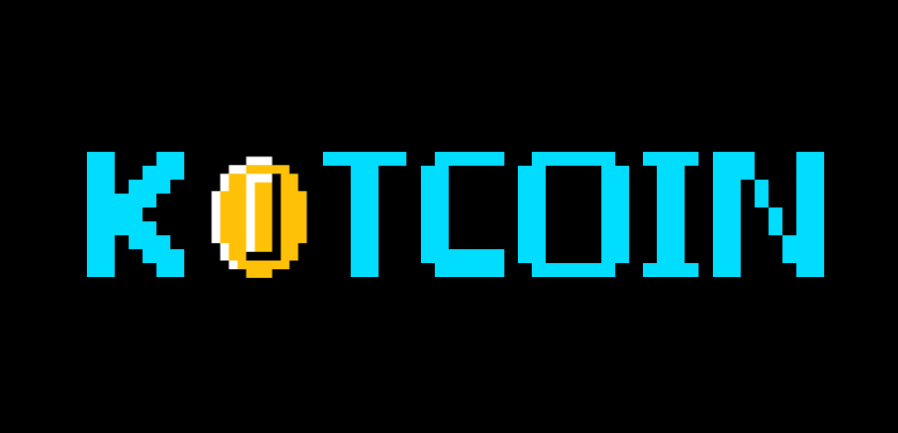

# Kotcoin  

Crypto matters!

Android Application MVI-based and written all in Kotlin for retrieving 10 most capitalized 
Crypto-currencies from [CoinMarketCap](https://coinmarketcap.com/api) API (Note: a free API Key is needed).

## Current work

- Adding DataBinding ✅
- Migrating to MVI ✅
- Adding ViewModel instead of Controllers ✅
- Adding Navigation JetPack ✅
- Using Material Elements: Cards mainly! ✅
- Using CLEAN structure modules: data + domain + presentation(app) ✅
- Adding Use Cases ✅
- Migrating to Hilt from Dagger ✅
- Adding Workers for saving daily price 
- Adding Room for local storage 
- Adding Dynamic Modules 
- Adding Compose() 
- Adding Kotlin Flow! 🤔
- Adding Tensorflow Lite! 
- Adding Lottie for animations 
- Adding MotionLayout for on-boardings 
- Adding a MockServer!

## Requirements

- Hilt Dagger 
- Retrofit 
- Gson/Kotson 
- AndroidRx 
- Mockito (Just few tests) 

## About Kotcoin

Kotcoin is based on Model-View-Intent MVI Arch. DI handled by Dagger and Reactive data flow handled by
RXJava. SOLID and CLEAN based project!

## Basic Guide

**IMPORTANT:** Add API key as `env` variable named: `KOTCOIN_API_TOKEN`, in macOS:

    launchctl setenv KOTCOIN_API_TOKEN "\"your_api_key\""

List variables with: `printenv`

## What's Next!

- Add Crypto single views
- Add Controller methods for filter, apply, modify data.
- Unit, Integration and UI Testing
- Errors handling
- Add more languages
- Improve UI/UX

