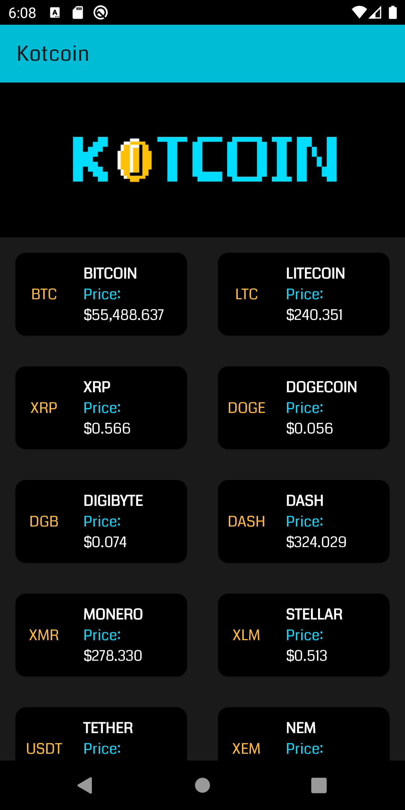
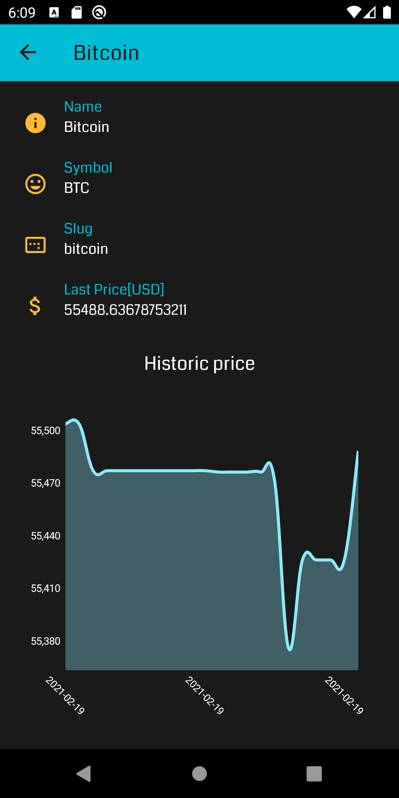

# Kotcoin :computer: :moneybag: 

Crypto matters!

Android Application **MVI-based** and written all in Kotlin for retrieving 10 most capitalized 
Crypto-currencies from [CoinMarketCap](https://coinmarketcap.com/api) API (_Note: eventually you will need a free API Key_).

## Preview

## Features

- MVI Architecture
- Dependency Injection with **Hilt**
- Modularized App: Data + Domain + Presentation + UI
- Cloud and Local data handling
- Local DB using **ROOM**
- Uses a **Worker** for retrieving data each 6 hours from cloud.
- Plot historic prices.

## Current work

Status of current work and new ideas which will be implemented soon...

- Adding DataBinding ✅
- Migrating to MVI ✅
- Adding ViewModel instead of Controllers ✅
- Adding Navigation JetPack ✅
- Using Material Elements: Cards mainly! ✅
- Using CLEAN structure modules: data + domain + presentation(app) ✅
- Adding Use Cases ✅
- Migrating to Hilt from Dagger ✅
- Adding Kotlin Flow! 🤔 _instead of rx java_ 
- Adding Tensorflow Lite! 
- Adding Lottie for animations 
- Adding MotionLayout for on-boardings 
- Adding a MockServer!
- Adding security wrapper API

